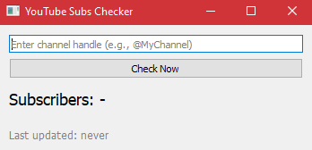

# YouTube Subs Widget

A simple desktop widget built with **PyQt5** that displays the current number of subscribers for a given YouTube channel handle. It updates automatically every 10 minutes and shows how long ago the last check was performed.

## ✨ Features

- 📦 Input any `@channelHandle` (e.g., `@MrBeast`)
- 🔁 Auto-refresh every 10 minutes
- 🔘 Manual refresh button
- ⏱️ "Last updated: X minutes ago" label
- 🔐 Uses YouTube Data API v3

---

## 🖼️ Screenshot

 <!-- Optional: add a screenshot if you have one -->

---

## 🚀 Getting Started

### 1. Clone the repository

```bash
git clone https://github.com/A-lex-Ra/youtube-subs-widget.git
cd youtube-subs-widget
````

### 2. Install dependencies

```bash
pip install -r requirements.txt
```

Or manually:

```bash
pip install PyQt5 google-api-python-client
```

### 3. Add your YouTube API Key

Open `keys.py` and replace the placeholder:

```python
yt_api_key="YOUR_API_KEY_HERE"
```

You can get a free API key here:
[https://console.cloud.google.com/apis/library/youtube.googleapis.com](https://console.cloud.google.com/apis/library/youtube.googleapis.com)

### 4. Run the app

```bash
python main.py
```

---

## 📄 Requirements

* Python 3.8+
* PyQt5
* google-api-python-client

---

## 🛠️ To-Do

* [ ] Save channel handle between sessions
* [ ] Add support for channel ID (not just handle)
* [ ] Dark mode / system tray support
* [ ] Graph of subscriber count over time

---

## 📄 License

MIT License
